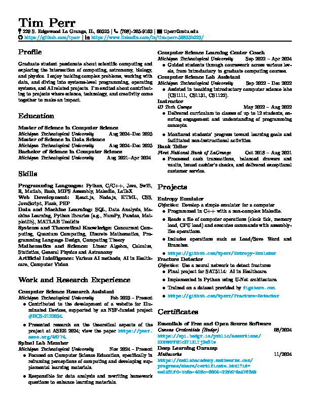

# Resume
Nothing special, just my resume.
You may have to download resume to view
[Resume](resume.pdf)

Requires fontawesome, run ``` tlmgr install fontawesome ``` if compiling on local machine, or remove icons in header if you don't care.

Run ``` magick resume.pdf resume.jpg ``` to convert to .jpg, allows for .md embedding.

